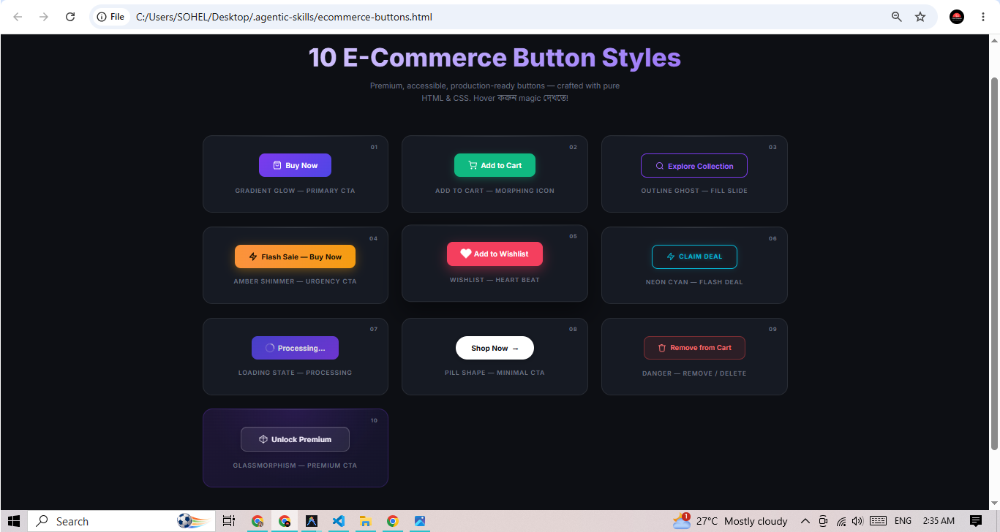
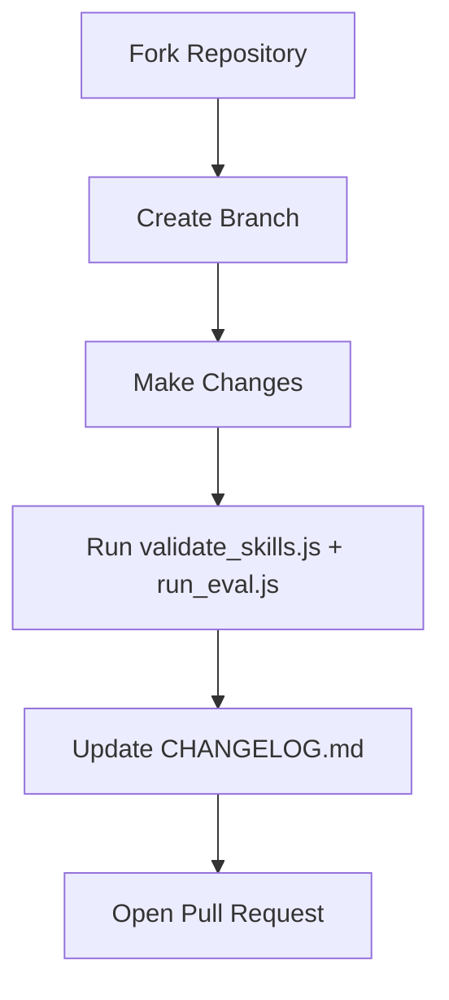

<div align="center">

# 🤖 Agentic Skills

### *Empowering AI Agents with Senior-Level Expertise & Playbooks*

[](LICENSE)
[](https://github.com/frnirobsohel/agentic-skills/stargazers)
[](https://github.com/frnirobsohel/agentic-skills/issues)
[](https://github.com/frnirobsohel/agentic-skills/pulls)

---

**Agentic Skills** is an open-source, highly-curated repository containing production-grade behaviors, design standards, and system playbooks for AI coding assistants (like Gemini, Cursor, Copilot, etc.). Optimize your AI workflows by giving your agents specialized knowledge.

[Explore Skills](#-available-skills) • [Setup Guide](#%EF%B8%8F-quick-setup) • [Demo](#-demo) • [Philosophy](docs/PHILOSOPHY.md) • [Contributing](CONTRIBUTING.md) • [Changelog](CHANGELOG.md)

</div>

---

## 🚀 Why Agentic Skills?

AI agents perform significantly better when they are guided by well-defined **persona constraints**, **quality standards**, and **workflows**. This repository provides modular configuration blocks to inject directly into your AI workspace.

> 💡 **Core Tenet:** *Better Research → Better Skills → Better AI Reasoning → Better Results.*  
> Read our full [Vision & Contributor Philosophy](docs/PHILOSOPHY.md) to understand the standards behind every playbook.

| 🛠️ Skill Name | 📂 Category | 🎯 Primary Goal | ⚡ Active Triggers |
| :--- | :--- | :--- | :--- |
| **[UI/UX Production Playbook](skills/uiux/SKILL.md)** | `UI/UX Design` | High-fidelity UI/UX design audits & accessibility standard compliance | `ui`, `ux`, `redesign`, `dashboard`, `accessibility` |
| **[Frontend Production Playbook](skills/frontend/SKILL.md)** | `Frontend` | High-performance React/Next.js development, state management, modern styling | `frontend`, `react`, `next.js`, `css`, `html`, `javascript` |
| **[System Design & Architecture Playbook](skills/system-design/SKILL.md)** | `System Design` | Scalable system architecture design, tech stack trade-offs, DB schema, and API contracts | `system design`, `architecture`, `tech stack`, `db design`, `data flow` |
| **[PHP & Laravel Production Playbook](skills/php/SKILL.md)** | `Backend` | Modern PHP development, PSR standards, database optimization, and security practices | `php`, `laravel`, `composer`, `psr`, `eloquent` |
| **[Python & Frameworks Production Playbook](skills/python/SKILL.md)** | `Backend` | Modern Python backend development, static typing, and FastAPI/Django standards | `python`, `django`, `fastapi`, `poetry` |
| **[Go & Concurrency Production Playbook](skills/go/SKILL.md)** | `Backend` | Concurrent, high-performance Go (Golang) backend development and resource safety | `go`, `golang`, `gin`, `fiber`, `gorm`, `goroutine` |
| **[DevOps & CI/CD Playbook](skills/devops/SKILL.md)** | `DevOps` | Optimized containerization, dependency-cached pipelines, and verified rollouts | `devops`, `docker`, `github actions`, `ci/cd`, `pipeline` |
| **[Rust & Systems Production Playbook](skills/rust/SKILL.md)** | `Backend` | Systems-level, highly performant, and memory-safe Rust backend programming | `rust`, `cargo`, `axum`, `actix`, `serde`, `borrow checker`, `lifetime` |

---

## ✨ Demo

### 🛒 10 E-Commerce Button Styles — Generated with a Single Prompt

> This entire UI was built by **Antigravity** using pure HTML & CSS — no framework, no JS library — from the simple prompt below.

**Prompt used:**

```
Create 10 E-commerce Buttons using HTML and CSS, and save the file so I can view it in the browser.
```

**Preview:**



**What was generated — 10 production-ready button styles:**

| # | Button Style | Effect |
|---|---|---|
| 01 | **Gradient Glow** | Violet-Indigo gradient with shine overlay on hover |
| 02 | **Add to Cart** | Emerald green with rotating cart icon on hover |
| 03 | **Outline Ghost** | Left-to-right fill slide animation |
| 04 | **Amber Shimmer** | Infinite shimmer loop for urgency/flash sale |
| 05 | **Wishlist Heart** | Rose color with heartbeat animation |
| 06 | **Neon Cyan** | Glowing border with neon light fill on hover |
| 07 | **Loading State** | Spinner animation with disabled state |
| 08 | **Pill Minimal** | White pill with sliding arrow |
| 09 | **Danger / Remove** | Red danger fill with trash icon |
| 10 | **Glassmorphism** | Blur glass effect with rotating gem icon |

**Features:**
- ✅ Pure HTML & CSS — zero dependencies
- ✅ Dark mode design with vibrant curated colors
- ✅ Micro-animations on every button
- ✅ WCAG accessible (48px touch targets, focus rings, `aria-label`)
- ✅ Google Fonts Inter typography
- ✅ Ready to open directly in any browser

📄 **Source file:** [`ecommerce-buttons.html`](ecommerce-buttons.html)

---

## 📂 Repository Layout

```
.
├── LICENSE
├── README.md
├── CHANGELOG.md           # Version history & release notes
├── CONTRIBUTING.md        # Contribution guidelines
├── AGENTS.md              # AI Agent Entrypoint & Skill Index
├── docs/
│   ├── PHILOSOPHY.md      # Vision, core tenets, & quality rules
│   └── SETUP.md           # Multi-platform setup (Cursor, Claude, Gemini, Copilot)
├── eval/
│   └── cases.json         # Routing eval test cases
├── scripts/
│   ├── validate_skills.js # Structure & reference integrity checks
│   └── run_eval.js        # Keyword routing eval runner
├── .github/
│   ├── workflows/         # CI validation on push/PR
│   └── ISSUE_TEMPLATE/    # Bug, feature, new-skill templates
├── preview.png            # Demo preview image
├── ecommerce-buttons.html # Demo: 10 E-Commerce Button Styles
└── skills/
    ├── uiux/
    │   ├── SKILL.md       # Full design principles, UX checklists & rules
    │   └── references/    # 17 modular docs (layout, color, motion…)
    └── frontend/
        ├── SKILL.md       # Frontend playbook (React, Next.js, TypeScript)
        └── references/    # 9 modular docs (architecture, state, testing…)
```

---

## ⚙️ Quick Setup

### 1. Project Setup (All Platforms)

Copy the router and skills into your project root:

```bash
cp AGENTS.md /path/to/your/project/
cp -r skills /path/to/your/project/
```

Your agent reads `AGENTS.md`, matches trigger keywords in the user's request, and loads the corresponding `SKILL.md` plus task-relevant `references/*.md` files.

### 2. Platform-Specific Paths

| Platform | Project | Global |
| :--- | :--- | :--- |
| **Cursor** | `AGENTS.md` at repo root, or `.cursor/skills/` | `~/.cursor/skills/` |
| **Claude Code** | `CLAUDE.md` + `.claude/skills/` | `~/.claude/skills/` |
| **Gemini** | `AGENTS.md` at repo root | `~/.gemini/config/` |
| **GitHub Copilot** | `.github/copilot-instructions.md` | VS Code Copilot instructions |

See [docs/SETUP.md](docs/SETUP.md) for step-by-step instructions per platform.

### 3. Validate Locally

```bash
node scripts/validate_skills.js   # structure, frontmatter, broken refs
node scripts/run_eval.js          # keyword routing eval (10 cases)
```

CI runs both scripts automatically on every push and pull request.

---

## 🧪 Eval & Quality

This repo includes lightweight eval infrastructure (not full LLM-based grading):

| Tool | Purpose |
| :--- | :--- |
| `scripts/validate_skills.js` | Checks `SKILL.md` frontmatter, reference file integrity, portable links |
| `scripts/run_eval.js` | Tests keyword routing against `eval/cases.json` (10 prompt cases) |
| `.github/workflows/validate-skills.yml` | CI gate — both scripts must pass |

To add a test case, edit [eval/cases.json](eval/cases.json) and run `node scripts/run_eval.js`.

---

## 🤝 Contributing

We welcome improvements to existing skills, new reference modules, eval cases, and infrastructure. For **new skill categories** (Backend, DevOps, Security, Testing), please open a [New Skill Proposal](.github/ISSUE_TEMPLATE/new_skill_proposal.md) issue first.

Full guidelines: [CONTRIBUTING.md](CONTRIBUTING.md)



---

## 🛡️ License

This project is open-source and licensed under the **MIT License**.

```
MIT License

Copyright (c) 2026 Sohel Akter

Permission is hereby granted, free of charge, to any person obtaining a copy
of this software and associated documentation files (the "Software"), to deal
in the Software without restriction, including without limitation the rights
to use, copy, modify, merge, publish, distribute, sublicense, and/or sell
copies of the Software, and to permit persons to whom the Software is
furnished to do so, subject to the following conditions:

The above copyright notice and this permission notice shall be included in all
copies or substantial portions of the Software.

THE SOFTWARE IS PROVIDED "AS IS", WITHOUT WARRANTY OF ANY KIND, EXPRESS OR
IMPLIED, INCLUDING BUT NOT LIMITED TO THE WARRANTIES OF MERCHANTABILITY,
FITNESS FOR A PARTICULAR PURPOSE AND NONINFRINGEMENT. IN NO EVENT SHALL THE
AUTHORS OR COPYRIGHT HOLDERS BE LIABLE FOR ANY CLAIM, DAMAGES OR OTHER
LIABILITY, WHETHER IN AN ACTION OF CONTRACT, TORT OR OTHERWISE, ARISING FROM,
OUT OF OR IN CONNECTION WITH THE SOFTWARE OR THE USE OR OTHER DEALINGS IN THE
SOFTWARE.
```

Please see the full [LICENSE](LICENSE) file for details.

---

<div align="center">

<sub>Copyright &copy; 2026 <a href="https://github.com/frnirobsohel">Sohel Akter</a>. Released under the <a href="LICENSE">MIT License</a>.</sub>


</div>
