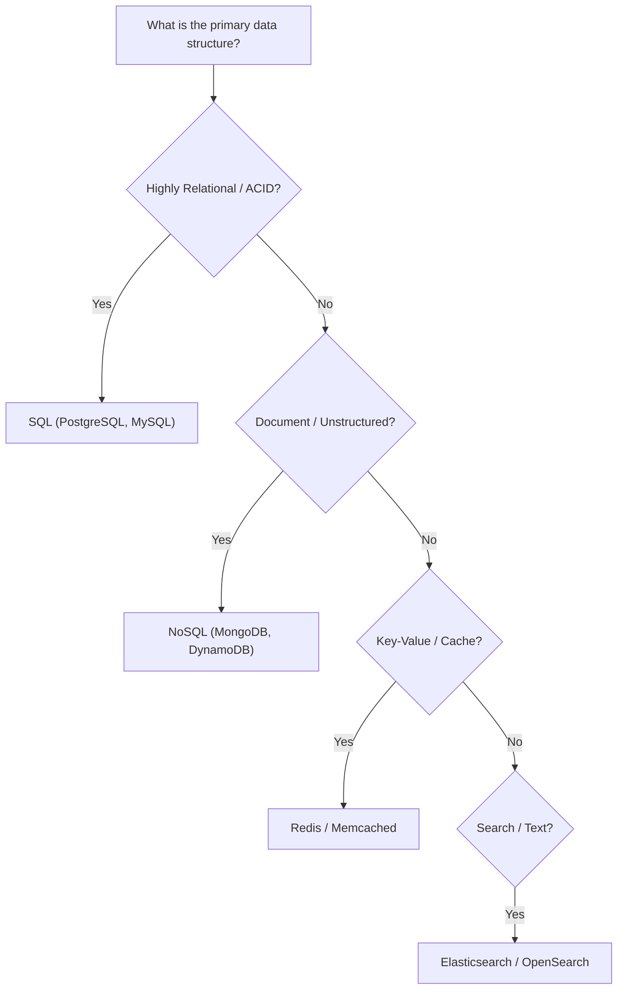

# Tech Stack Selection Guidelines

When choosing a technology stack, you must evaluate the project's requirements against architectural trade-offs (e.g., development velocity, scalability, operational complexity, and performance).

---

## 1. Frontend Rendering Strategies

Choose the rendering pattern based on the application's SEO needs, initial page load requirements, and content dynamic nature:

| Strategy | Ideal for | Pros | Cons |
| :--- | :--- | :--- | :--- |
| **CSR (Client-Side Rendering)** | Interactive dashboards, SaaS apps, private portals (behind auth) | Rich user interactivity, reduced server load | Poor SEO, slower Initial Page Load (FCP) |
| **SSR (Server-Side Rendering)** | E-commerce, blogs, public feeds, SEO-sensitive sites | Excellent SEO, fast FCP, secure API keys | Higher server load/cost, slower time-to-first-byte (TTFB) |
| **SSG (Static Site Generation)** | Marketing pages, portfolios, documentation sites | Blazing fast, cheap hosting (CDN), highly secure | Build times grow with content, stale content without rebuilds |
| **ISR (Incremental Static Regeneration)** | Large scale content sites, product directories | SSG speed with background page regeneration | Eventual consistency, complex edge cases |

---

## 2. Backend Language & Framework Selection

Evaluate backend technologies based on concurrency patterns, raw speed, ecosystem support, and development velocity:

- **Node.js (Express / NestJS / Fastify - JavaScript/TypeScript):**
  - *Best for:* I/O-heavy applications, rapid prototyping, sharing types with frontend (monorepos).
  - *Trade-off:* Single-threaded CPU performance. Avoid for heavy computational tasks.
- **Python (FastAPI / Django):**
  - *Best for:* Data science integrations, machine learning, rapid APIs (FastAPI).
  - *Trade-off:* Slower raw execution speed, dependency management complexity.
- **Go (Golang):**
  - *Best for:* High-concurrency services, microservices, high-performance networking, low memory footprint.
  - *Trade-off:* Verbose code, slower development velocity compared to dynamic languages.

---

## 3. Database Selection Framework

Never default to a database without comparing consistency, transaction safety, and scaling patterns:

### Database Comparison Matrix:

| DB Type | Primary Options | Best For | Trade-offs |
| :--- | :--- | :--- | :--- |
| **Relational (SQL)** | PostgreSQL, MySQL | Complex queries, transactions (ACID), structured data | Harder to scale horizontally |
| **Document (NoSQL)** | MongoDB, DynamoDB | Rapid schema iteration, unstructured/semi-structured data | Weak relationship handling, eventual consistency |
| **Key-Value** | Redis | Caching, session storage, pub-sub systems | In-memory storage limits data size |
| **Vector DB** | pgvector (Postgres), Pinecone | AI application embeddings, similarity search | High index build times, specialised queries |
